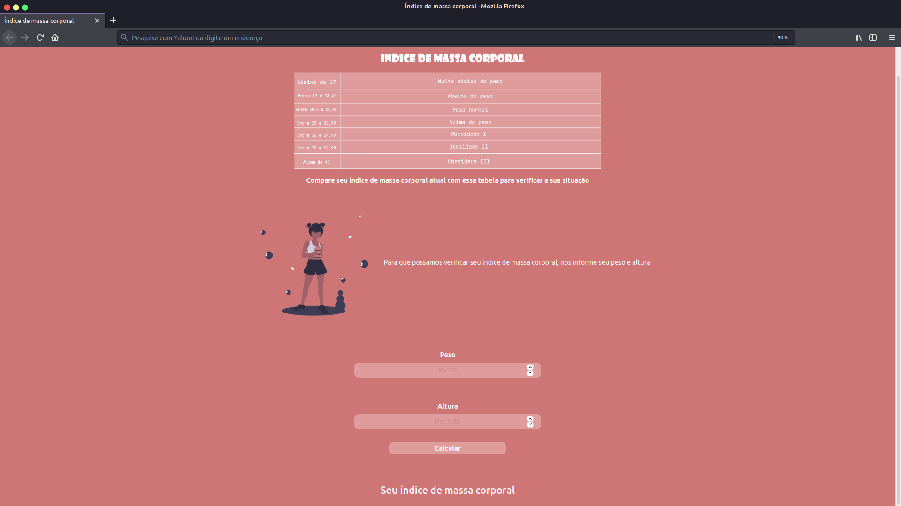
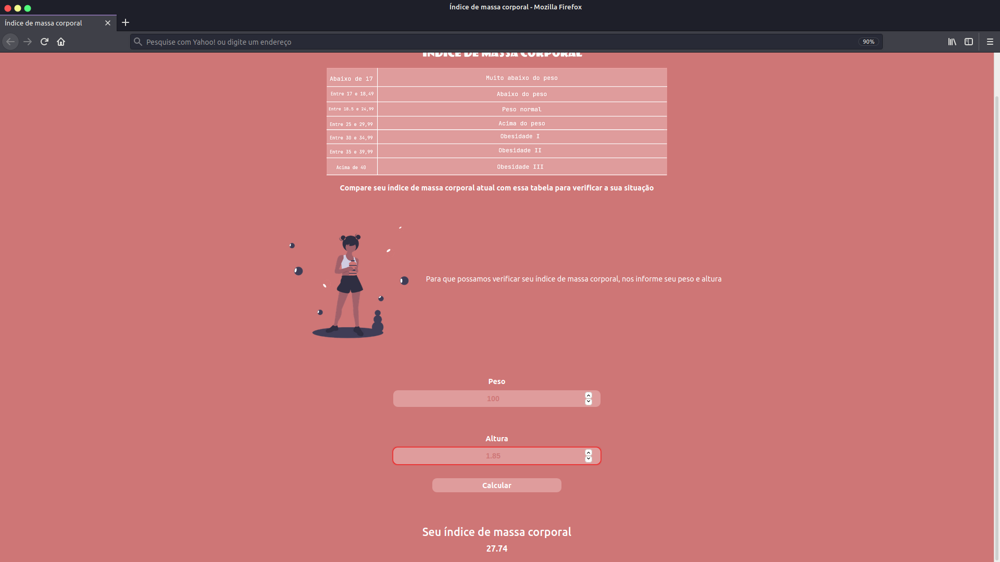

  
<h1 align="center">Calculo de Índice de massa corporal</h1>
<h3 align='center'>Portifólio 💻</h3>

Site de verificação de índice de massa corporal.

De maneira simples e rápida o usuário consegue verificar seu IMC(índice de massa corporal) e comparar com a tabela acima, para verificar se o usuário se encontra acima, abaixo ou no peso ideal

Esta é a tela incial do site. Inicialmente você pode visualizar uma tabela, nela possui todas as informações sobre cada medida de IMC.

 Na parte inferior você encontra os campos de 'Peso' e 'Altura'. Apos preencher esses campos, você receberá o seu IMC.

  

Após preencher os campos, o usuário recebe as informações corretas sobre seu índice de massa corporal

  

<h2 align="center">Aplicação concluída 🚧</h2>

Aplicação onde coloquei os conhecimentos que adquiri em: Javascript, HTML e CSS  durante meu período de estudos.

<h2 align="center">Tecnlogias 🖇️</h2>
<h3 align="center">Tecnologias utilizadas nesse projeto</h3>

🔨 HTML

🔨 Javascript

🔨 CSS

🔨 Bootstrap

  
<h1 align="center">Desenvolvido por Felipe Costa</h1>